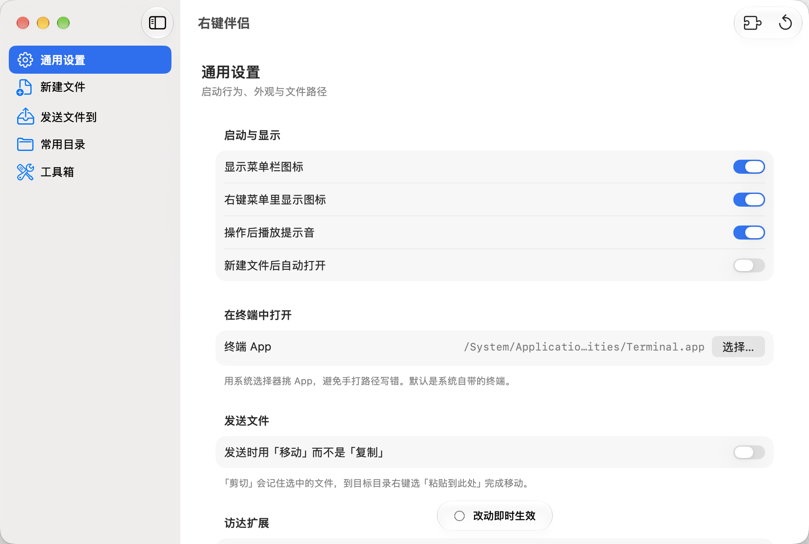
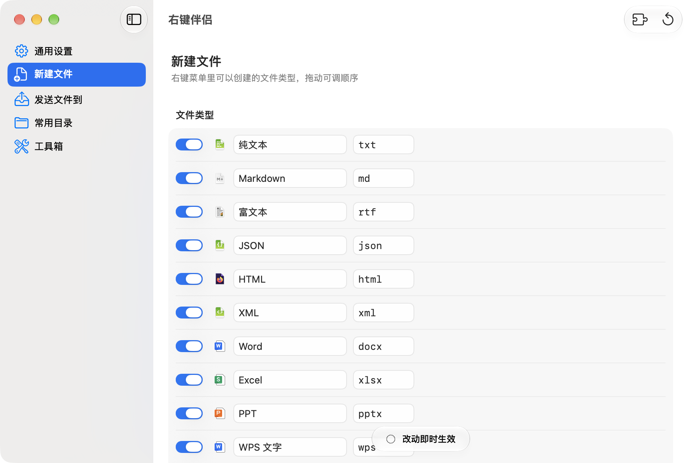

# 右键伴侣

macOS Finder 右键增强，对标 iRightMouse「超级右键」。全部用 macOS 系统原生 API 实现，无第三方依赖。



> **系统要求：macOS 27.0 或更高。**
> 用了 macOS 27 的 `DynamicViewContent.reorderable()` 和 Liquid Glass，不为旧系统写降级分支。
>
> **构建要求：装 Xcode。** `@State` / `@Namespace` 是编译器宏，实现（`SwiftUIMacros`）只在 Xcode 的工具链里，命令行工具不带。
> 构建脚本直接用 Xcode 工具链的绝对路径，**不需要 sudo，也不改你的 `xcode-select` 全局设置**。

## 下载安装

不用自己编译：[**下载 DMG**](https://github.com/a1287448852/right-click-mate/releases/latest)

打开 DMG，把「右键伴侣」拖进 Applications。**首次打开会被系统拦下**，提示"无法验证开发者"——本项目没有 Apple 开发者签名（$99/年），不是有问题。放行方法二选一：

1. 在「应用程序」里**右键点图标 → 打开 → 再点一次「打开」**
2. 或者终端执行 `xattr -cr "/Applications/右键伴侣.app"`

然后在 App 的「通用设置」里点「打开访达扩展管理面板」，确认扩展是开启状态。

自己打包 DMG：`./make-dmg.sh`

## 功能

- **新建文件**：17 种文件类型（纯文本 / Markdown / Word / Excel / PPT / WPS / Pages / PSD …），可增删、可拖拽排序，列表顺序就是右键菜单顺序
- **复制路径 / 复制文件名 / 用文件名新建文件夹**
- **剪切 → 粘贴到此处**：剪切后文件带 Finder 角标（剪刀图标），一眼看出哪些还在待粘贴状态
- **常用目录 / 复制到**：一键跳转或发送文件到指定目录
- **图片处理**：转 PNG / JPG / HEIC / TIFF、生成 ICNS、生成 macOS / iOS 图标集、设为墙纸
- **工具箱**：文件信息（MD5 / SHA256）、解散文件夹、隐藏/显示、授予写入权限、发送快捷方式到桌面、彻底删除、在终端中打开

## 界面

SwiftUI 写的设置窗口，五个面板：**通用设置 / 新建文件 / 发送文件到 / 常用目录 / 工具箱**。
改动即时写入 `~/Library/Application Support/SuperRightClick/config.json`，扩展每次弹菜单时重读，改完不用重启。

每个文件类型显示 macOS 给它的**真实系统图标**，一眼认得出；拖动行可以调整顺序，而**列表顺序就是右键菜单顺序**：



## 构建与安装

```bash
./build-swiftui.sh          # 构建（SwiftUI 版，需要 Xcode）
./build-swiftui.sh install  # 构建 + 装到 /Applications/右键伴侣.app + 注册扩展
```

菜单没立刻出现就跑 `killall Finder`。

`build.sh` 是保留的 AppKit 版本，用命令行工具即可构建，作为回退方案。

## 卸载

```bash
rm -rf "/Applications/右键伴侣.app"
rm -rf ~/Library/Application\ Support/SuperRightClick   # 配置和日志
```

## 设计

视觉遵循一套 Apple 风格的设计令牌（品牌蓝 `#0066cc`、系统蓝 `#007aff`、卡片面 `#ffffff ↔ #1c1c1e`、圆角按原生尺寸收敛），全部落在 `Sources/Theme.swift`。

### Liquid Glass 的用法

**两个版本并存**，源码和构建脚本都分开：

| 版本 | 源码 | 构建脚本 | 工具链要求 |
|---|---|---|---|
| **SwiftUI（当前使用）** | `Sources/SwiftUI/SettingsView.swift` | `build-swiftui.sh` | 需要 Xcode |
| AppKit（保留可回退） | `Sources/SettingsWindow.swift` | `build.sh` | 命令行工具即可 |

SwiftUI 版为什么需要 Xcode：`@State` / `@Namespace` 是**编译器宏**，实现（`SwiftUIMacros`）只在 Xcode 的工具链里，命令行工具不带。
`build-swiftui.sh` 直接用 Xcode 工具链的绝对路径（`/Applications/Xcode.app/Contents/Developer/Toolchains/...`），所以**不需要 sudo，也不改你的 `xcode-select` 全局设置**。

按 Apple《Adopting Liquid Glass》的三条硬规定设计：

1. **玻璃属于导航层/控件层** —— 侧栏直接交给 `NavigationSplitView` 的系统 `List`，macOS 自动给它 Liquid Glass，一行自绘代码都不用
2. **玻璃不能叠玻璃** —— 所以没有自绘的选中胶囊，选中态用系统自己的实现
3. **克制使用自绘玻璃** —— 全 app 只有一处：底部状态胶囊。用 `GlassEffectContainer` 包住（共享采样、性能更好），`glassEffectID` + `glassEffectTransition(.matchedGeometry)` + `.bouncy` 让它"改动即时生效 ↔ 已保存"之间**形变**

内容层用 `Form(.grouped)` 和 `List`，**完全不铺玻璃**。

### 让玻璃显形的关键一步：窗口必须透明

一开始 UI 看着"用了玻璃却不像玻璃"，根因是**窗口不透明**——系统侧栏和工具栏的玻璃没有背后的内容可以采样，渲染出来就是一块灰板。

修法是窗口层（不是内容层）的两件事，都在 `SettingsView.swift` 里：

- `TransparentWindow`：把 `NSWindow.isOpaque` 设为 false、`backgroundColor` 设为 clear

**关键：不要再自己铺一层 `NSVisualEffectView` 背板。** 我一开始铺了（`.underWindowBackground`），结果是**两层模糊叠加**——窗口背板 + 系统侧栏材质——糊成一块灰板，反而更不玻璃。窗口一旦透明，系统侧栏材质自己就会采样桌面，单层采样才通透。

SwiftUI 这代**没有 `.window` 的 `containerBackground` 放置点**（只有 `.tabView` / `.navigation`），所以这步必须桥 AppKit。之后侧栏的玻璃立刻显形，而**内容层依然不透明**（`Color(nsColor: .windowBackgroundColor)`），文字对比度不受影响。

### 用到的 macOS 27 新特性

- **`DynamicViewContent.reorderable()` + `reorderContainer(for:move:)`** —— 三个列表支持拖拽排序，列表顺序就是右键菜单顺序。`ReorderDifference` 的 `sources` / `destination.position`（`.before(id)` / `.end`）由 `applyReorder` 落到数组上
- **`NSMenuItem.preferredImageVisibility`** —— 右键菜单图标显隐（AppKit 扩展侧）
- **`NSGlassEffectView.effectIsInteractive`** —— 可交互玻璃（AppKit 版用）
- 部署目标 **macOS 27.0**：`.reorderable()` 是 27 专属，不为兼容 26 写降级分支


### App 图标

`tools/make-icon.swift` 用 CoreGraphics 画（没有 Xcode / Icon Composer，走不了 `.icon` 分层格式）：
品牌蓝渐变方块 + 顶部受光 + 斜向镜面 + 底部内阴影 + 内侧描边，中间是白色光标。
`build.sh` 里自动生成 `.iconset` 再用 `iconutil` 打包成 `AppIcon.icns`。

## 右键菜单

```
右键伴侣 ▸
    新建 纯文本 (.txt)          ← 勾了「置顶」的类型放第一层
    新建文件 ▸                  ← 其余类型收这层
        Markdown / 富文本 / JSON / HTML / XML / Word / Excel / PPT / WPS ...
    ────────────────
    复制路径 · 拷贝名称 · 用文件名新建文件夹 · 剪切
    粘贴到此处（移动 N 项）      ← 剪切之后才出现
    ────────────────
    常用目录 ▸ · 复制到 ▸ / 移动到 ▸
    ────────────────
    文件信息（MD5 / SHA256）· 解散文件夹 · 隐藏 / 显示
    授予写入权限 · 发送快捷方式到桌面 · 彻底删除（不进废纸篓）
    ────────────────
    在终端中打开
```

## 架构

```
右键伴侣.app
├── Contents/MacOS/SuperRightClick                    主 App（设置界面，不沙盒）
└── Contents/PlugIns/SuperRightClickFinderSync.appex  扩展（沙盒，由 Finder 加载）
```

`Sources/Config.swift` 被两个 target 共用，主 App 写、扩展读。

## 坑（都踩过了）

| 现象 | 原因 |
|---|---|
| `Undefined symbols: _main` | appex 入口点是 `_NSExtensionMain`，不是 `_main`，见 build.sh 的 `-Xlinker` |
| 主 App 的开关对扩展无效 | 沙盒里 `NSHomeDirectory()` 是**容器路径**，得用 `getpwuid` 取真实主目录 |
| 点菜单没反应、`created=false` | 目标目录在主目录之外（`/Library`、外接盘…），需要 `temporary-exception.files.absolute-path.read-write`。iRightMouse 是靠让用户去开「完全磁盘访问权限」解决同一问题 |
| 动作里 `representedObject` 是 `nil` | FinderSync 的 XPC 会把 `NSMenuItem` 重建，`representedObject` 丢失；用 `tag` 传数组下标兜底 |
| `pluginkit -a` 静默失败 | 之前要先用 `lsregister -f` 让 LaunchServices 认识这个 App |

调试看日志：`~/Library/Application Support/SuperRightClick/diag.log`
（每个动作都会记一行 `action <名字> tag=… represented=… 选中=…`）

## 还没做的（按价值排序）

1. 图片转换：HEIC / ICNS / JPG / PNG、macOS / iOS 图标集生成
2. 文件信息独立窗口，而不是系统弹窗
3. 模板文件可视化添加（现在只能手改 config.json 的 `template` 字段）
4. iCloud / OneDrive 目录里显示菜单
5. 开机自启、鼠标中键 / 三指轻点触发

## 参与贡献

**欢迎提 [Issue](https://github.com/a1287448852/right-click-mate/issues)** —— 看到了就会修、会优化。功能建议、性能问题、兼容性反馈、UI 意见都欢迎，不用客气。

**也欢迎你贡献代码。** 修 bug、加功能、做性能优化都可以，一起把它打磨成一个真正高性能的 macOS 原生应用。

提交 PR 之前建议先开个 Issue 聊一下思路，避免方向不一致白做——不是流程要求，只是省你时间。

## 许可证

MIT。转载、修改、商用都可以，**保留版权声明即可**（见 [LICENSE](LICENSE)）。
